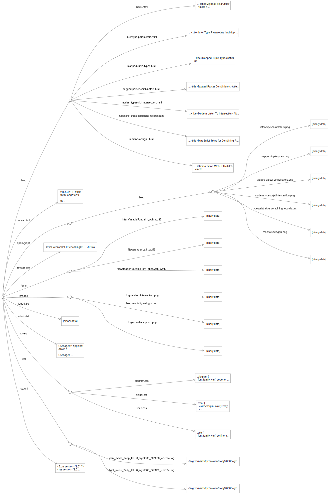

This project explores rewriting the blog at https://github.com/mighdoll/mighdoll-site in Origami.

One thesis of the Origami project is that the web is missing an accepted convention for representing async trees: hierarchical structures whose values may take some time to compute. Without such a convention, constructing digital artifacts like blogs is complex enough that most people don't want to do it from scratch.

Among other things, this leads to an ecosystem of hundreds of static site generators (SSGs), all of which handle the same basic task of generating a folder of website resources in different ways. This places a substantial learning curve on anyone trying to adopt a new SSG. It also means that code written for one SSG is generally entangled with that SSG's idiosyncrasies and so cannot be immediately reused in the context of another.

The basic exploration here is: how simple can we make all the steps of generating a blog?

## Site representation

The Origami `src/site.ori` file defines the overall structure of the site.

We can ask Origami to render this as a diagram:

The `site.ori` file uses a [syntax](https://weborigami.org/language/syntax) that will be unfamiliar. That said, the effect of this file is to coordinate the complete construction of the site's resource tree — every part of the site is created as a direct result of some line in `site.ori`. Origami makes no assumptions about the structure of the source project or the final site, or how the former gets transformed to the latter. All of that is under the developer's control.

## Data representation

In the spirit of using the simplest representation possible, all the post data is represented in a single plain JavaScript object. The object's keys are the post slugs, and the values are sub-objects with properties for title, publication date, etc.

The Origami file `postData.ori` constructs this object. This object could be used by JavaScript code; here it is consumed by other Origami functions.

One slightly unusual — but completely reasonable — choice in the original Astro project is to consolidate all top-level post data like titles and dates in a single place. (In contrast, blog projects typically keep such data in post front matter.)

In the Astro version, this is data is entered into the astro-db "database", then pulled out by the blog post template. The Astro posts are markdown files with a `slug` property in front matter. JavaScript code joins the two sources together.

In the Origami version, the top-level post data is a YAML file `posts.yaml`. This could just as easily be a JSON file, JS file, or something else. The Origami posts are markdown files that use the slug in the filename.

The `postData.ori` file defines a pipeline — a chain of function calls — that merges the YAML data and markdown into a set of post objects. This pipeline reads the YAML file as plain JS objects, then looks up the corresponding markdown post and adds its text to the object. The pipeline also converts the markdown to HTML, then puts the posts in reverse chronological order.

The data that results from this pipeline is used four ways: to generate the index page, to generate the pages in the `blog` area, to generate the RSS feed, and to generate a set of OpenGraph images.

## Templates

The other `.ori` files are templates, most of which are functions that accept some kind of object and return text.

- The Astro template `Header.astro` is just HTML, so is ported here as a plain HTML file `header.html`.
- The utility `prettyDate.js` is a JavaScript function invoked directly by the `post.ori` template.
- Astro templates appear to use JSX. One side effect of this is that HTML tags like `link` tags show up as `<link/>` (with a closing slash). The Origami templates just use regular HTML, where `link` tags are self-closing: `<link>` (no closing slash).
- Astro does something with stylesheets that I can't understand, using `import` statements that somehow generate files like `_slug_.DvgHcWUj.css`. The Origami version just uses `link` tags that load stylesheets.

The blog template currently does **not** implement code highlighting with Shiki TwoSlash. Given the general nature of that library, I'm fairly confident it could be added here without much more work.

## OpenGraph images

The Astro project uses the astro-og-canvas utility to turn post properties into a PNG image for use in social media tags. The astro-og-canvas feature would be useful in non-Astro projects, so it's too bad the code and API are so intertwined with Astro internals. The implementation also uses the proprietary `CanvasKit` wrapper around a standard `Canvas`; anyone attempting to modify the code has to first learn to use `CanvasKit`.

I think it's better if this feature is a pure function that takes a small dictionary of options and returns a PNG image. A rough cut at this is implemented in `ogImage.js`, which has nothing directly to do with Origami. The `site.ori` file calls `ogImage.js` to generate images for all the blog posts.

Internally, this uses the general-purpose `canvas` package for an implementation of the `Canvas` API in Node. That package does have some non-standard features, but if you know the `Canvas` API, you can modify `ogImage.js` to fit your needs.

For this proof of concept, `ogImage.js` only accepts PNG images. I converted the JPEG and WEBP images from the Astro project to PNGs.

## Performance

I can't yet do a real apples-to-apples comparison because the Origami build omits the Projects area and the use of code highlighting. But for what it's worth: on my machine an Astro build is about 12 seconds, the Origami build is about 2 seconds.

Performance aside, Astro provides features that Origami does not, such as type validation of post schema via Zod and probably other features. Such features could probably be added.

## Code size and complexity

Very roughly speaking, counting lines of code in the Origami version and the corresponding portions of the Astro version suggests the Origami accomplishes a similar result in slightly less code, perhaps 10% less.

Both Origami and Astro have non-trivial learning curves, but I believe the Origami version requires mastering a set of concepts that are more generally applicable to a wide range of projects. Origami doesn't make any assumptions that you're building a website, for example.

I don't know Astro well, but it appears to do a fair amount of magic to wire things for you in what it hopes is a helpful way. That's probably great when you're starting, but my experience with similar SSGs is that you always hit a point where you have to start fighting the framework to do something its designers didn't anticipate.

All the work being done by Origami here could be rewritten in plain JavaScript on top of Origami's general-purpose `async-tree` library. This would be somewhat more verbose. Rewriting a [sample Origami blog](https://github.com/WebOrigami/pondlife) to create an equivalent [plain JavaScript version](https://github.com/WebOrigami/pondlife-js) took about 33% more code, but had the advantage of a much simpler dependency.
